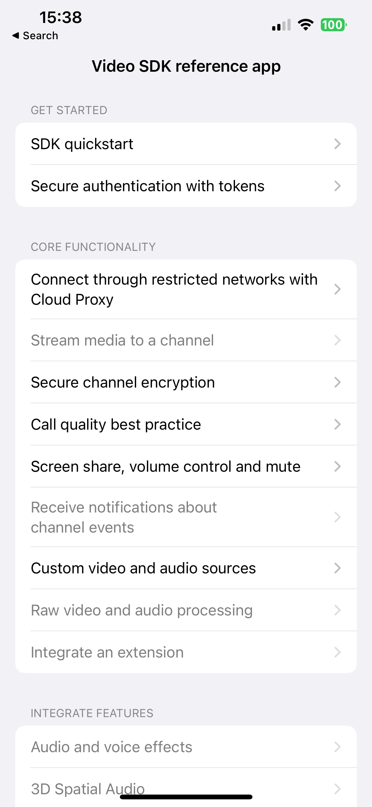
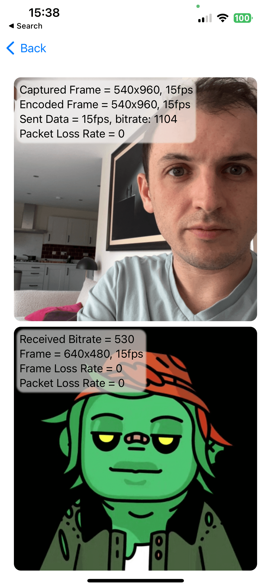
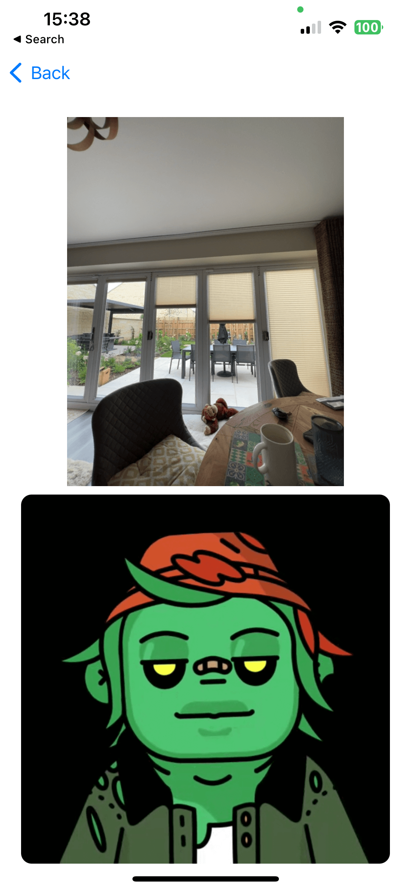
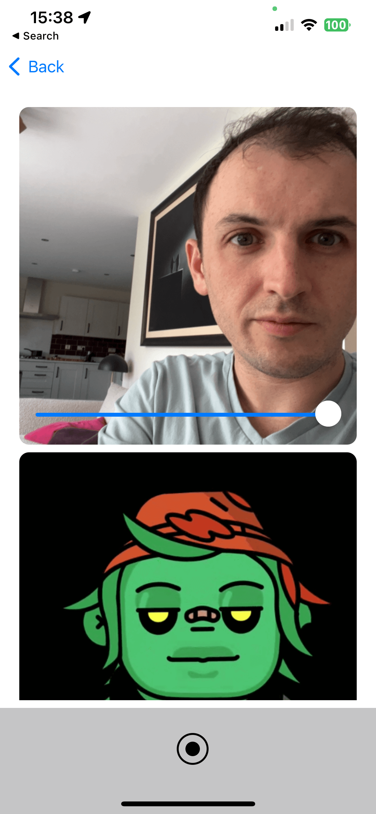

# Video SDK reference app (iOS)

This app demonstrates using Agora's Video SDK for real-time communication in a SwiftUI app.

This example app is a robust and comprehensive documentation reference app for iOS, designed to enhance your productivity and understanding. It's built to be flexible, easily extensible, and beginner-friendly.

To understand the contents better, you can go to [Agora's Documentation](https://docs.agora.io), which explains each example in more detail.

## Prerequisites

Before getting started with this example app, please ensure you have the following software installed on your machine:

- Xcode 13.0 or later.
- Swift 5.5 or later.
- An iOS device or emulator running iOS 13.0 or later.

## Run the App

1. Clone the repository

To clone the repository to your local machine, open Terminal and navigate to the directory where you want to clone the repository. Then, use the following command:

```sh
git clone https://github.com/AgoraIO/video-sdk-samples-ios.git
```

2. Open the project

Navigate to [Example-App](Example-App), and open [Docs-Examples.xcodeproj](Example-App/Docs-Examples.xcodeproj).

> All dependencies are installed with Swift Package Manager, so will be fetched automatically by Xcode.

3. Update Signing

As with any Xcode project, head to the target, "Signing & Capabilities", and add your team, and modify the bundle identifier to make it unique.

4. Modify config.json

The file [config.json](agora-manager/config.json) is locaed in the [agora-manager](agora-manager) directory, and must have at least the following modifications made:

- appId: Update to your Agora Project ID, found at https://console.agora.io

You may also need to make these modifications:

- rtcToken: Add in your temporary token if you need and have generated one
- tokenUrl: Add the URL to your token server if you have one; there are a few one-click deployment options [here](https://github.com/AgoraIO-Community/agora-token-service).

5. Build and run the project

To build and run the project, use the build button (Cmd+R) in Xcode. Select your preferred device/simulator as the scheme.

## Examples

You'll find numerous examples illustrating the functionality and features of this reference app in the root directory. Each example is self-contained in its own directory, providing an easy way to understand how to use the app. For more information about each example, see the README file within its directory.

- [SDK quickstart](get-started-sdk)
- [Secure authentication with tokens](authentication-workflow)
- [Connect through restricted networks with Cloud Proxy](cloud-proxy)
- [Stream media to a channel](play-media)
- [Secure channel encryption](media-stream-encryption)
- [Call quality best practice](ensure-channel-quality)
- [Screen share, volume control and mute](product-workflow)
- [Custom video and audio sources](custom-video-and-audio)
- [Raw video and audio processing](stream-raw-audio-and-video)
- [Geofencing](geofencing)

## Screenshots

| Landing page | Call quality best practice | Custom video and audio sources | Screen share, volume control and mute |
|:-:|:-:|:-:|:-:|
|  |  |  |  |

## Contact

If you have any questions, issues, or suggestions, please file an issue in our [GitHub Issue Tracker](https://github.com/AgoraIO/video-sdk-samples-ios/issues).

